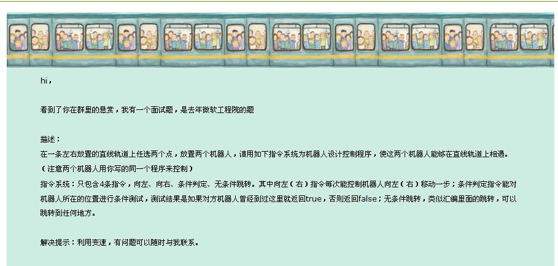

#第九章、闲话链表追赶问题
==========================================
##前奏

**有这样一个问题**：在一条左右水平放置的直线轨道上任选两个点，放置两个机器人，请用如下指令系统为机器人设计控制程序，使这两个机器人能够在直线轨道上相遇。（注意两个机器人用你写的同一个程序来控制）。

指令系统：只包含4条指令，向左、向右、条件判定、无条件跳转。其中向左（右）指令每次能控制机器人向左（右）移动一步；条件判定指令能对机器人所在的位置进行条件测试，测试结果是如果对方机器人曾经到过这里就返回true，否则返回false；无条件跳转，类似汇编里面的跳转，可以跳转到任何地方。

ok，这道很有意思的趣味题是去年微软工程院的题，文末将给出解答（如果急切想知道此问题的答案，可以直接跳到本文第三节）。同时，我们看到其实这个题是一个典型的追赶问题，那么追赶问题在哪种面试题中比较常见?对了，链表追赶。本章就来阐述这个问题。有不正之处，望不吝指正。

##第一节、求链表倒数第k个结点
**第13题、题目描述**：

输入一个单向链表，输出该链表中倒数第k个结点,
链表的倒数第0个结点为链表的尾指针。

**分析**：此题一出，相信，稍微有点 经验的同志，都会说到：设置两个指针p1,p2，首先p1和p2都指向head，然后p2向前走k步，这样p1和p2之间就间隔k个节点，最后p1和p2同时向前移动，直至p2走到链表末尾。

前几日有朋友提醒我说，让我讲一下此种求链表倒数第k个结点的问题。我想，这种问题，有点经验的人恐怕都已了解过，无非是利用两个指针一前一后逐步前移。但他提醒我说，如果参加面试的人没有这个意识，它怎么也想不到那里去。

那在平时准备面试的过程中如何加强这一方面的意识呢?我想，除了平时遇到一道面试题，尽可能用多种思路解决，以延伸自己的视野之外，便是平时有意注意观察生活。因为，相信，你很容易了解到，其实这种链表追赶的问题来源于生活中长跑比赛，如果平时注意多多思考，多多积累，多多发现并体味生活，相信也会对面试有所帮助。

ok，扯多了，下面给出这个题目的主体代码，如下：

```cpp
struct ListNode
{
    char data;
    ListNode* next;
};
ListNode* head,*p,*q;
ListNode *pone,*ptwo;

//@heyaming, 第一节,求链表倒数第k个结点应该考虑k大于链表长度的case。
ListNode* fun(ListNode *head,int k)
{
    assert(k >= 0);
    pone = ptwo = head;
    for( ; k > 0 && ptwo != NULL; k--)
    ptwo=ptwo->next;
    if (k > 0) return NULL;

    while(ptwo!=NULL)
    {
        pone=pone->next;
        ptwo=ptwo->next;
    }
    return pone;
}
```

####扩展：
这是针对链表单项链表查找其中倒数第k个结点。试问，如果链表是双向的，且可能存在环呢?请看第二节、编程判断两个链表是否相交。
##第二节、编程判断两个链表是否相交
**题目描述**：给出两个单向链表的头指针（如下图所示）


比如h1、h2，判断这两个链表是否相交。这里为了简化问题，我们假设两个链表均不带环。

**分析**：这是来自编程之美上的微软亚院的一道面试题目。请跟着我的思路步步深入（部分文字引自编程之美）：

1. 直接循环判断第一个链表的每个节点是否在第二个链表中。但，这种方法的时间复杂度为O(Length(h1) * Length(h2))。显然，我们得找到一种更为有效的方法，至少不能是O（N^2）的复杂度。
2. 针对第一个链表直接构造hash表，然后查询hash表，判断第二个链表的每个结点是否在hash表出现，如果所有的第二个链表的结点都能在hash表中找到，即说明第二个链表与第一个链表有相同的结点。时间复杂度为为线性：O(Length(h1) + Length(h2))，同时为了存储第一个链表的所有节点，空间复杂度为O(Length(h1))。是否还有更好的方法呢，既能够以线性时间复杂度解决问题，又能减少存储空间？
3. 进一步考虑“如果两个没有环的链表相交于某一节点，那么在这个节点之后的所有节点都是两个链表共有的”这个特点，我们可以知道，如果它们相交，则最后一个节点一定是共有的。而我们很容易能得到链表的最后一个节点，所以这成了我们简化解法的一个主要突破口。那么，我们只要判断俩个链表的尾指针是否相等。相等，则链表相交；否则，链表不相交。
所以，先遍历第一个链表，记住最后一个节点。然后遍历第二个链表，到最后一个节点时和第一个链表的最后一个节点做比较，如果相同，则相交，否则，不相交。这样我们就得到了一个时间复杂度，它为O((Length(h1) + Length(h2))，而且只用了一个额外的指针来存储最后一个节点。这个方法时间复杂度为线性O（N），空间复杂度为O（1），显然比解法三更胜一筹。
4. 上面的问题都是针对链表无环的，那么如果现在，链表是有环的呢?还能找到最后一个结点进行判断么?上面的方法还同样有效么?显然，这个问题的本质已经转化为判断链表是否有环。那么，如何来判断链表是否有环呢?

####总结：

所以，事实上，这个判断两个链表是否相交的问题就转化成了：

1. 先判断带不带环
2. 如果都不带环，就判断尾节点是否相等
3. 如果都带环，判断一链表上俩指针相遇的那个节点，在不在另一条链表上。
如果在，则相交，如果不在，则不相交。

**解决**：

1. 那么，如何编写代码来判断链表是否有环呢?因为很多的时候，你给出了问题的思路后，面试官可能还要追加你的代码，ok，如下（设置两个指针(p1, p2)，初始值都指向头，p1每次前进一步，p2每次前进二步，如果链表存在环，则p2先进入环，p1后进入环，两个指针在环中走动，必定相遇）：

```cpp
//copyright@ KurtWang
//July、2011.05.27。
struct Node
{
    int value;
    Node * next;
};
//1.先判断带不带环
//判断是否有环，返回bool，如果有环，返回环里的节点
//思路：用两个指针，一个指针步长为1，一个指针步长为2，判断链表是否有环
bool isCircle(Node * head, Node *& circleNode, Node *& lastNode)
{
    Node * fast = head->next;
    Node * slow = head;
    while(fast != slow && fast && slow)
    {
        if(fast->next != NULL)
            fast = fast->next;

        if(fast->next == NULL)
            lastNode = fast;
        if(slow->next == NULL)
            lastNode = slow;

        fast = fast->next;
        slow = slow->next;

    }
    if(fast == slow && fast && slow)
    {
        circleNode = fast;
        return true;
    }
    else
        return false;
}
```

 2. 对于问题2和问题3，如果都不带环，就判断尾节点是否相等，如果都带环，判断一链表上俩指针相遇的那个节点，在不在另一条链表上。下面是综合解决这个问题的代码：

```cpp
//判断带环不带环时链表是否相交
//2.如果都不带环，就判断尾节点是否相等
//3.如果都带环，判断一链表上俩指针相遇的那个节点，在不在另一条链表上。
bool detect(Node * head1, Node * head2)
{
    Node * circleNode1;
    Node * circleNode2;
    Node * lastNode1;
    Node * lastNode2;

    bool isCircle1 = isCircle(head1,circleNode1, lastNode1);
    bool isCircle2 = isCircle(head2,circleNode2, lastNode2);

    //一个有环，一个无环
    if(isCircle1 != isCircle2)
        return false;
    //两个都无环，判断最后一个节点是否相等
    else if(!isCircle1 && !isCircle2)
    {
        return lastNode1 == lastNode2;
    }
    //两个都有环，判断环里的节点是否能到达另一个链表环里的节点
    else
    {
        Node * temp = circleNode1->next;  //updated，多谢苍狼 and hyy。
        while(temp != circleNode1)
        {
            if(temp == circleNode2)
                return true;
            temp = temp->next;
        }
        return false;
    }

    return false;
}
```

**扩展2：求两个链表相交的第一个节点**

思路：在判断是否相交的过程中要分别遍历两个链表，同时记录下各自长度。

- @Joshua：这个算法需要处理一种特殊情况，即：其中一个链表的头结点在另一个链表的环中，且不是环入口结点。这种情况有两种意思：1)如果其中一个链表是循环链表，则另一个链表必为循环链表，即两个链表重合但头结点不同；2)如果其中一个链表存在环(除去循环链表这种情况)，则另一个链表必在此环中与此环重合，其头结点为环中的一个结点，但不是入口结点。在这种情况下我们约定，如果链表B的头结点在链表A的环中，且不是环入口结点，那么链表B的头结点即作为A和B的第一个相交结点；如果A和B重合(定义方法时形参A在B之前)，则取B的头结点作为A和B的第一个相交结点。

- @风过无痕：读《程序员编程艺术》，补充代码2012年7月18日 周三下午10:15

	发件人: "風過無痕" <luxiaoxun001@qq.com>将发件人添加到联系人

	收件人: "zhoulei0907" <zhoulei0907@yahoo.cn>

	你好

	&nbsp;&nbsp;&nbsp;&nbsp;看到你在csdn上博客，学习了很多，看到下面一章，有个扩展问题没有代码，发现自己有个，发给你吧，思路和别人提出来的一样，感觉有代码更加完善一些，呵呵

扩展2：求两个链表相交的第一个节点

思路：如果两个尾结点是一样的，说明它们有重合；否则两个链表没有公共的结点。

在上面的思路中，顺序遍历两个链表到尾结点的时候，我们不能保证在两个链表上同时到达尾结点。这是因为两个链表不一定长度一样。但如果假设一个链表比另一个长L个结点，我们先在长的链表上遍历L个结点，之后再同步遍历，这个时候我们就能保证同时到达最后一个结点了。由于两个链表从第一个公共结点开始到链表的尾结点，这一部分是重合的。因此，它们肯定也是同时到达第一公共结点的。于是在遍历中，第一个相同的结点就是第一个公共的结点。

在这个思路中，我们先要分别遍历两个链表得到它们的长度，并求出两个长度之差。在长的链表上先遍历若干次之后，再同步遍历两个链表，直到找到相同的结点，或者一直到链表结束。PS：没有处理一种特殊情况：就是一个是循环链表，而另一个也是，只是头结点所在位置不一样。

代码如下：

```cpp
ListNode* FindFirstCommonNode( ListNode *pHead1, ListNode *pHead2)
{
      // Get the length of two lists
      unsigned int nLength1 = ListLength(pHead1);
      unsigned int nLength2 = ListLength(pHead2);
      int nLengthDif = nLength1 - nLength2;

      // Get the longer list
      ListNode *pListHeadLong = pHead1;
      ListNode *pListHeadShort = pHead2;
      if(nLength2 > nLength1)
      {
            pListHeadLong = pHead2;
            pListHeadShort = pHead1;
            nLengthDif = nLength2 - nLength1;
      }

      // Move on the longer list
      for(int i = 0; i < nLengthDif; ++ i)
            pListHeadLong = pListHeadLong->m_pNext;

      // Move on both lists
      while((pListHeadLong != NULL) && (pListHeadShort != NULL) && (pListHeadLong != pListHeadShort))
      {
            pListHeadLong = pListHeadLong->m_pNext;
            pListHeadShort = pListHeadShort->m_pNext;
      }

      // Get the first common node in two lists
      ListNode *pFisrtCommonNode = NULL;
      if(pListHeadLong == pListHeadShort)
            pFisrtCommonNode = pListHeadLong;

      return pFisrtCommonNode;
}

unsigned int ListLength(ListNode* pHead)
{
      unsigned int nLength = 0;
      ListNode* pNode = pHead;
      while(pNode != NULL)
      {
            ++ nLength;
            pNode = pNode->m_pNext;
      }
      return nLength;
}
```

关于判断单链表是否相交的问题，还可以看看此篇文章：<http://www.cppblog.com/humanchao/archive/2008/04/17/47357.html>。ok，下面，回到本章前奏部分的那道非常有趣味的智力题。
##第三节、微软工程院面试智力题
**题目描述：**

在一条左右水平放置的直线轨道上任选两个点，放置两个机器人，请用如下指令系统为机器人设计控制程序，使这两个机器人能够在直线轨道上相遇。（注意两个机器人用你写的同一个程序来控制）

指令系统：只包含4条指令，向左、向右、条件判定、无条件跳转。其中向左（右）指令每次能控制机器人向左（右）移动一步；条件判定指令能对机器人所在的位置进行条件测试，测试结果是如果对方机器人曾经到过这里就返回true，否则返回false；无条件跳转，类似汇编里面的跳转，可以跳转到任何地方。

**分析：**我尽量以最清晰的方式来说明这个问题（大部分内容来自ivan，big等人的讨论）：

1. 首先题目要求很简单，就是要你想办法让A最终能赶上B，A在后，B在前，都向右移动，如果它们的速度永远一致，那A是永远无法追赶上B的。但题目给出了一个条件判断指令，即如果A或B某个机器人向前移动时，若是某个机器人经过的点是第二个机器人曾经经过的点，那么程序返回true。对的，就是抓住这一点，A到达曾经B经过的点后，发现此后的路是B此前经过的，那么A开始提速两倍，B一直保持原来的一倍速度不变，那样的话，A势必会在|AB|/move_right个单位时间内，追上B。ok，简单伪代码如下：

        start:
        if(at the position other robots have not reached)
            move_right
        if(at the position other robots have reached)
            move_right
            move_right
        goto start
再简单解释下上面的伪代码（@big）：

	A------------B

	|&nbsp;&nbsp;&nbsp;&nbsp;&nbsp;&nbsp;&nbsp;&nbsp;&nbsp;&nbsp;&nbsp;&nbsp;&nbsp;&nbsp;&nbsp;&nbsp;&nbsp;|

	在A到达B点前，两者都只有第一条if为真，即以相同的速度向右移动，在A到达B后，A只满足第二个if，即以两倍的速度向右移动，B依然只满足第一个if，则速度保持不变，经过|AB|/move_right个单位时间，A就可以追上B。
2. 有个细节又出现了，正如ivan所说，

        if(at the position other robots have reached)
            move_right
            move_right
上面这个分支不一定能提速的。why?因为如果if条件花的时间很少，而move指令发的时间很大（实际很可能是这样），那么两个机器人的速度还是基本是一样的。
那作如何修改呢?:

        start:
        if(at the position other robots have not reached)
            move_right
            move_left
            move_right
        if(at the position other robots have reached)
            move_right
        goto start

        -------
这样改后，A的速度应该比B快了。
3.  然要是说每个指令处理速度都很快，AB岂不是一直以相同的速度右移了?那到底该作何修改呢?请看：

        go_step()
        {
           向右
           向左
           向右
        }
        --------
        三个时间单位才向右一步

        go_2step()
        {
           向右
        }
        ------

	一个时间单向右一步向左和向右花的时间是同样的，并且会占用一定时间。 如果条件判定指令时间比移令花的时间较少的话，应该上面两种步法，后者比前者快。至此，咱们的问题已经得到解决。

最后，感谢蜜蜂提供的这道有意思的面试题：



本章完。
* * *
版权所有，本人对本blog内所有任何内容享有版权及著作权。网络转载，请以链接形式注明出处。
